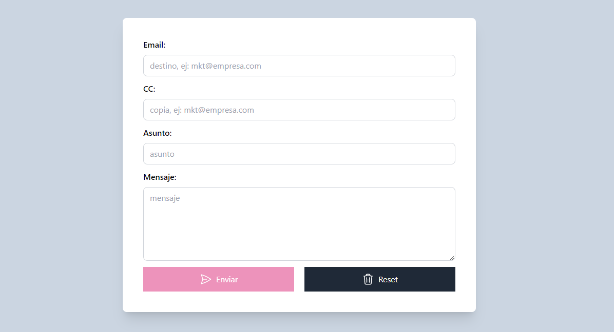
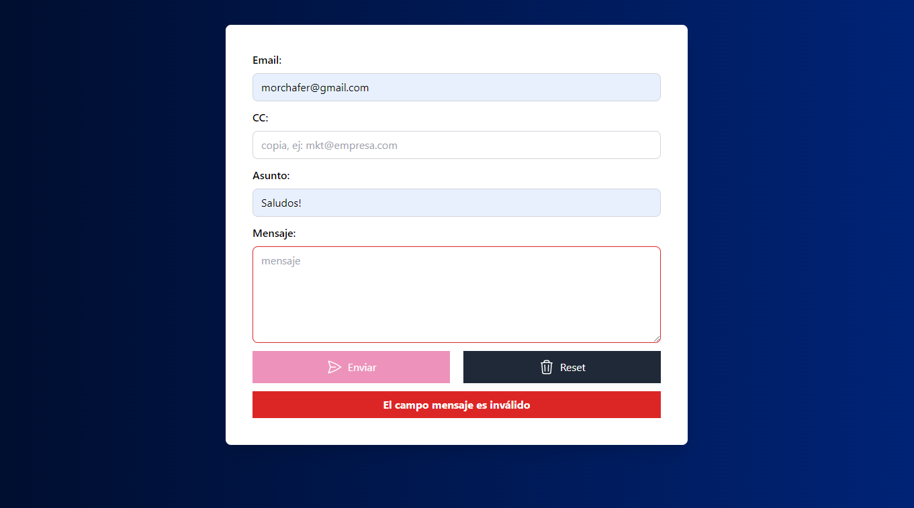
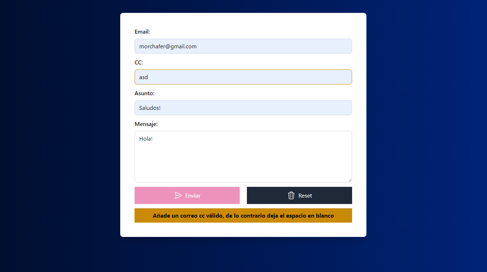

# Email Sending Simulator

### Details:

- Client-side validations
- RegEx for email address validation
- Vanilla JavaScript (no framework or library used)
- Modern JavaScript (+ES6)
- DOM Scripting

[Go to demo](https://email-sending-simulator.netlify.app/)

### Previews:

