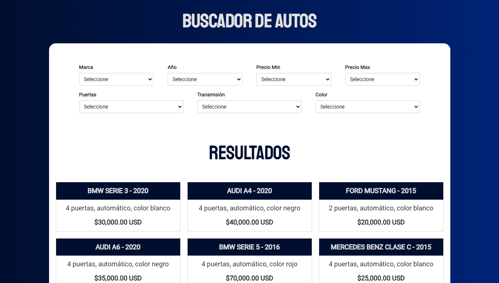
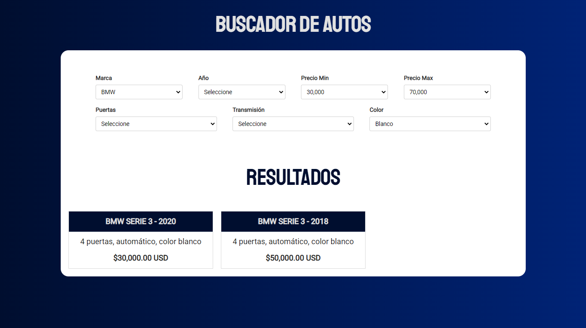
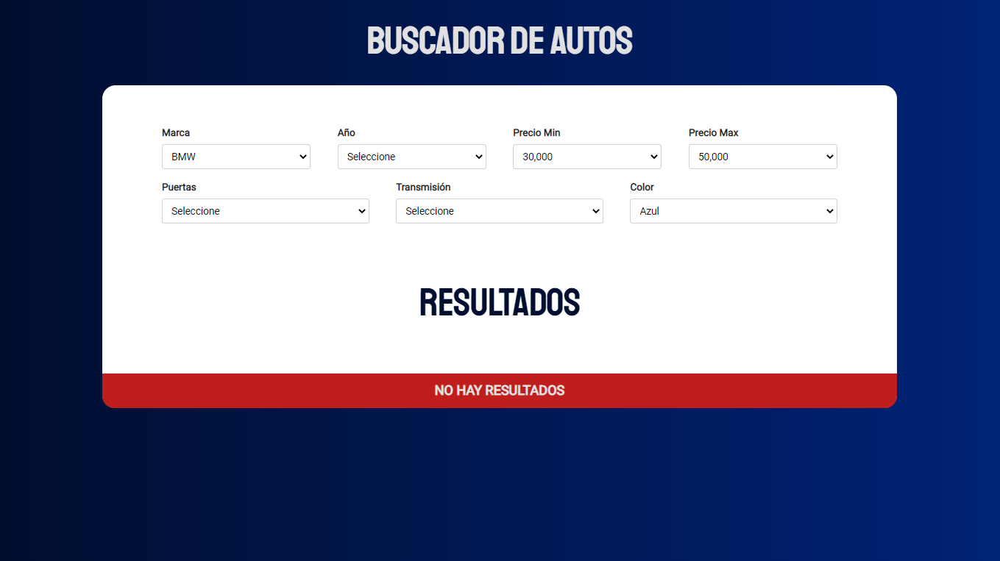

# Multi-Field Data Filtering

### Details:

- Higher Order Functions
- Method Chaining
- Vanilla JavaScript (no framework or library used)
- Modern JavaScript (+ES6)
- DOM Scripting

[Go to demo](https://multi-field-data-filtering.netlify.app/)

### Previews:

