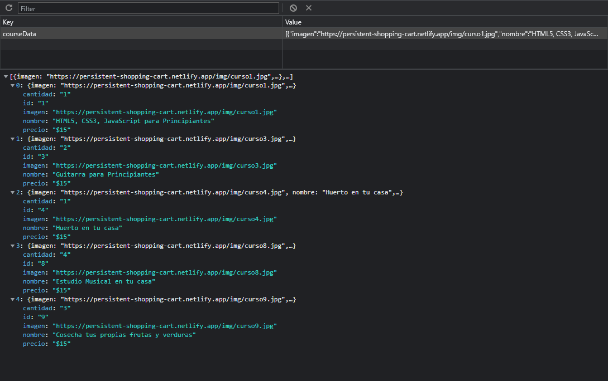

# Persistent Shopping Cart with Local Storage

### Details:

- _localStorage_ API implementation for cart data
- You can add items to the cart and remove any or all of them
- Vanilla JavaScript (no framework or library used)
- Modern JavaScript (+ES6)
- DOM Scripting

[Go to demo](https://persistent-shopping-cart.netlify.app/)

### Previews:

