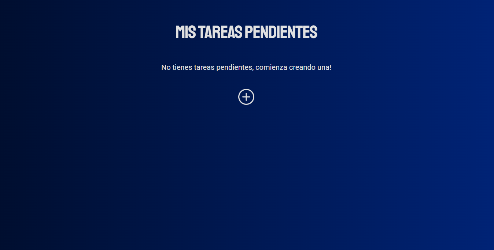
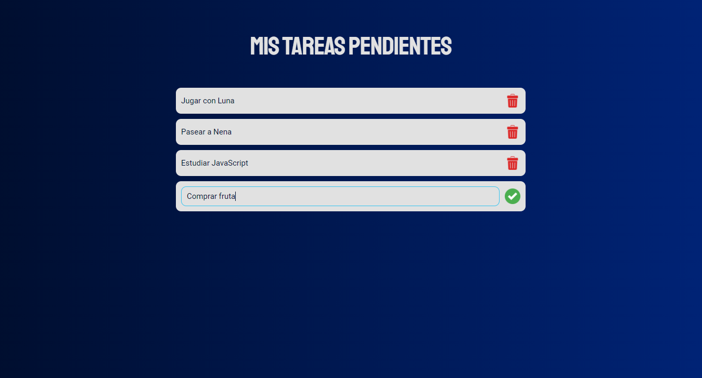
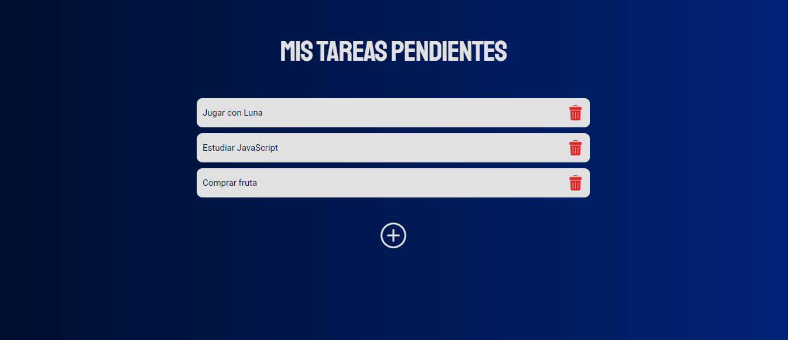
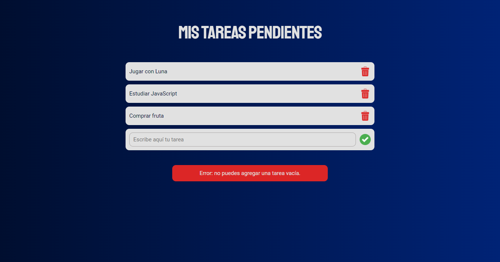
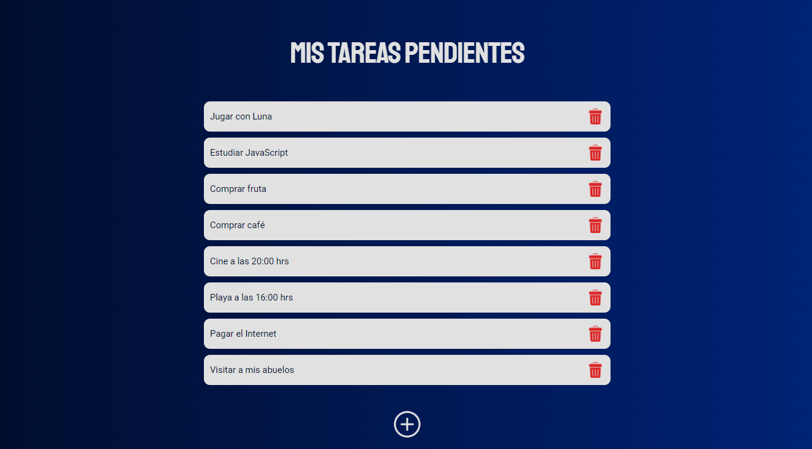
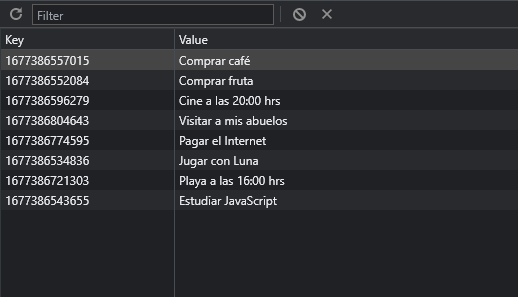

# To-Do List App with Local Storage

### Details:

- _localStorage_ API implementation for task data
- You can create and delete tasks
- Vanilla JavaScript (no framework or library used)
- Modern JavaScript (+ES6)
- DOM Scripting

[Go to demo](https://to-do-list-app-fm.netlify.app/)

### Previews:

